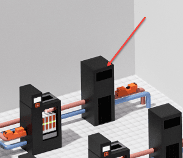
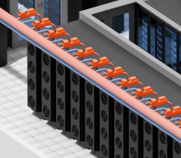
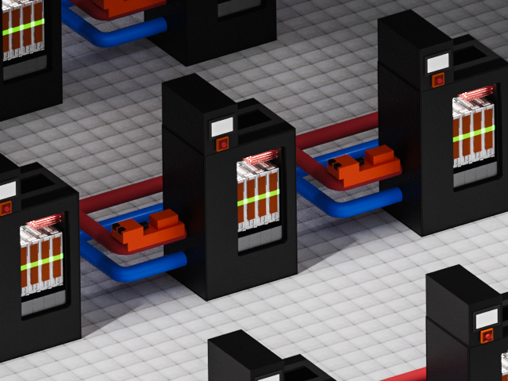
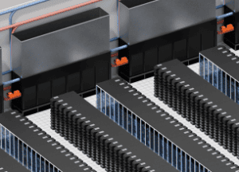
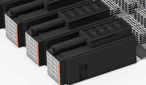
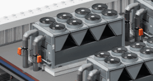

# Components and Copy

## Cooling Distribution Units (CDUs)

Cooling Distribution Units (CDUs) provide chilled water or water glycol mixes for heat generating components such as servers. Belimo offers a comprehensive range of characterized control valves (CCVs), electronic pressure independent valves (EPIVs), and Energy Valves that are ideally suited for CDUs. These valves provide precise flow control and are easily adjustable as your cooling needs grow.

## Direct to Chip (Cold Plate)

Direct to chip liquid cooling, often referred to as cold plate, is one of the most common techniques for cooling servers with high heat dissipating needs, such as those for high performance computing (HPC), AI (artificial intelligence), and ML (machine learning). The Belimo Energy Valve is an ideal solution for this application because it can maintain a constant differential pressure across the rack.  The result is that precise flow is delivered to each cold plate, even if a server is removed for maintenance.

## Rear Door Heat Exchanger (RDHX)

Precise flow control is crucial for Rear-Door Heat Exchangers (RDHx). Belimo electronic pressure independent valves (EPIVs) and characterized control valves (CCVs) allow for accurate and repeatable flow control performance to ensure optimal performance for your RDHx.

## Two Phase Immersion Cooling

Two-phase immersion cooling units require precise water flow to ensure the dielectric fluid condenses.  Belimo electronic pressure independent valves (EPIVs) maintain precise flow to the coil even as pressure fluctuations are introduced to the system. The Belimo Energy Valve can monitor the water's supply and return temperature, and calculate the thermal heat that has been dissipated.

## CRAH

Computer Room Air Handling (CRAH) units provide conditioned air to the white space. Belimo electronic pressure independent valves (EPIVs) are essential components in CRAH units providing precise and reliable control of water flow. These valves offer significant advantages in maintaining optimal temperature and humidity levels within data centers.

## Fan Wall
Belimo damper actuators are essential in fan walls, delivering precise airflow control to servers within the white space. Characterized control valves and electronic pressure independent valves (EPIVs) regulate water flow through the coils, ensuring effective cooling to maintain the necessary supply air temperatures. Together, these Belimo devices are critical in maintaining optimal environmental conditions for sensitive IT infrastructure.

## Fire and Smoke
Belimo fire and smoke actuators are essential safety devices designed to protect data centers from fire and smoke hazards. These damper actuators are integrated into fire and smoke detection systems and are responsible for controlling various mechanical components to mitigate the spread of fire and smoke during an emergency.

## Generators

Generators ensure servers still have power in the event of a power failure. Belimo fail-safe actuators are the ideal solution to provide the appropriate amount of combustion air needed for these generators. Fail-safe functionality ensures airflow can be shut off immediately in the event of an issue. NEMA 4 options are available if the actuators are to be installed outside of the generator.

## Central Plant

Central plants provide chilled water to the entire data center. Given the huge cooling demands of datacenters, this can only be accomplished with large flow rates and accordingly, large valves. Belimo Butterfly Valves with high performance actuators are ideally suited for this application due to their high close off pressure, low leakage rates, and NEMA 4 enclosures.

## Two Phase Immersion Cooling

Two-phase immersion cooling units require precise water flow to ensure the dielectric fluid condenses.  Belimo electronic pressure independent valves (EPIVs) maintain precise flow to the coil even as pressure fluctuations are introduced to the system. The Belimo Energy Valve can monitor the water's supply and return temperature, and calculate the thermal heat that has been dissipated.

## CRAH

Computer Room Air Handling (CRAH) units provide conditioned air to the white space. Belimo electronic pressure independent valves (EPIVs) are essential components in CRAH units providing precise and reliable control of water flow. These valves offer significant advantages in maintaining optimal temperature and humidity levels within data centers.

## Fan Wall
Belimo damper actuators are essential in fan walls, delivering precise airflow control to servers within the white space. Characterized control valves and electronic pressure independent valves (EPIVs) regulate water flow through the coils, ensuring effective cooling to maintain the necessary supply air temperatures. Together, these Belimo devices are critical in maintaining optimal environmental conditions for sensitive IT infrastructure.

## Fire and Smoke
Belimo fire and smoke actuators are essential safety devices designed to protect data centers from fire and smoke hazards. These damper actuators are integrated into fire and smoke detection systems and are responsible for controlling various mechanical components to mitigate the spread of fire and smoke during an emergency.

## Generators

Generators ensure servers still have power in the event of a power failure. Belimo fail-safe actuators are the ideal solution to provide the appropriate amount of combustion air needed for these generators. Fail-safe functionality ensures airflow can be shut off immediately in the event of an issue. NEMA 4 options are available if the actuators are to be installed outside of the generator.

## Central Plant

Central plants provide chilled water to the entire data center. Given the huge cooling demands of datacenters, this can only be accomplished with large flow rates and accordingly, large valves. Belimo Butterfly Valves with high performance actuators are ideally suited for this application due to their high close off pressure, low leakage rates, and NEMA 4 enclosures.

## Two Phase Immersion Cooling

Two-phase immersion cooling units require precise water flow to ensure the dielectric fluid condenses.  Belimo electronic pressure independent valves (EPIVs) maintain precise flow to the coil even as pressure fluctuations are introduced to the system. The Belimo Energy Valve can monitor the water's supply and return temperature, and calculate the thermal heat that has been dissipated.

## CRAH

Computer Room Air Handling (CRAH) units provide conditioned air to the white space. Belimo electronic pressure independent valves (EPIVs) are essential components in CRAH units providing precise and reliable control of water flow. These valves offer significant advantages in maintaining optimal temperature and humidity levels within data centers.

## Fan Wall
Belimo damper actuators are essential in fan walls, delivering precise airflow control to servers within the white space. Characterized control valves and electronic pressure independent valves (EPIVs) regulate water flow through the coils, ensuring effective cooling to maintain the necessary supply air temperatures. Together, these Belimo devices are critical in maintaining optimal environmental conditions for sensitive IT infrastructure.

## Fire and Smoke
Belimo fire and smoke actuators are essential safety devices designed to protect data centers from fire and smoke hazards. These damper actuators are integrated into fire and smoke detection systems and are responsible for controlling various mechanical components to mitigate the spread of fire and smoke during an emergency.

## Generators

Generators ensure servers still have power in the event of a power failure. Belimo fail-safe actuators are the ideal solution to provide the appropriate amount of combustion air needed for these generators. Fail-safe functionality ensures airflow can be shut off immediately in the event of an issue. NEMA 4 options are available if the actuators are to be installed outside of the generator.

## Central Plant

Central plants provide chilled water to the entire data center. Given the huge cooling demands of datacenters, this can only be accomplished with large flow rates and accordingly, large valves. Belimo Butterfly Valves with high performance actuators are ideally suited for this application due to their high close off pressure, low leakage rates, and NEMA 4 enclosures.

## Two Phase Immersion Cooling

Two-phase immersion cooling units require precise water flow to ensure the dielectric fluid condenses.  Belimo electronic pressure independent valves (EPIVs) maintain precise flow to the coil even as pressure fluctuations are introduced to the system. The Belimo Energy Valve can monitor the water's supply and return temperature, and calculate the thermal heat that has been dissipated.

## CRAH

Computer Room Air Handling (CRAH) units provide conditioned air to the white space. Belimo electronic pressure independent valves (EPIVs) are essential components in CRAH units providing precise and reliable control of water flow. These valves offer significant advantages in maintaining optimal temperature and humidity levels within data centers.

## Fan Wall
Belimo damper actuators are essential in fan walls, delivering precise airflow control to servers within the white space. Characterized control valves and electronic pressure independent valves (EPIVs) regulate water flow through the coils, ensuring effective cooling to maintain the necessary supply air temperatures. Together, these Belimo devices are critical in maintaining optimal environmental conditions for sensitive IT infrastructure.

## Fire and Smoke
Belimo fire and smoke actuators are essential safety devices designed to protect data centers from fire and smoke hazards. These damper actuators are integrated into fire and smoke detection systems and are responsible for controlling various mechanical components to mitigate the spread of fire and smoke during an emergency.

## Generators

Generators ensure servers still have power in the event of a power failure. Belimo fail-safe actuators are the ideal solution to provide the appropriate amount of combustion air needed for these generators. Fail-safe functionality ensures airflow can be shut off immediately in the event of an issue. NEMA 4 options are available if the actuators are to be installed outside of the generator.

## Central Plant

Central plants provide chilled water to the entire data center. Given the huge cooling demands of datacenters, this can only be accomplished with large flow rates and accordingly, large valves. Belimo Butterfly Valves with high performance actuators are ideally suited for this application due to their high close off pressure, low leakage rates, and NEMA 4 enclosures.

## Two Phase Immersion Cooling

Two-phase immersion cooling units require precise water flow to ensure the dielectric fluid condenses.  Belimo electronic pressure independent valves (EPIVs) maintain precise flow to the coil even as pressure fluctuations are introduced to the system. The Belimo Energy Valve can monitor the water's supply and return temperature, and calculate the thermal heat that has been dissipated.

## CRAH

Computer Room Air Handling (CRAH) units provide conditioned air to the white space. Belimo electronic pressure independent valves (EPIVs) are essential components in CRAH units providing precise and reliable control of water flow. These valves offer significant advantages in maintaining optimal temperature and humidity levels within data centers.

## Fan Wall
Belimo damper actuators are essential in fan walls, delivering precise airflow control to servers within the white space. Characterized control valves and electronic pressure independent valves (EPIVs) regulate water flow through the coils, ensuring effective cooling to maintain the necessary supply air temperatures. Together, these Belimo devices are critical in maintaining optimal environmental conditions for sensitive IT infrastructure.

## Fire and Smoke
Belimo fire and smoke actuators are essential safety devices designed to protect data centers from fire and smoke hazards. These damper actuators are integrated into fire and smoke detection systems and are responsible for controlling various mechanical components to mitigate the spread of fire and smoke during an emergency.

## Generators

Generators ensure servers still have power in the event of a power failure. Belimo fail-safe actuators are the ideal solution to provide the appropriate amount of combustion air needed for these generators. Fail-safe functionality ensures airflow can be shut off immediately in the event of an issue. NEMA 4 options are available if the actuators are to be installed outside of the generator.

## Central Plant

Central plants provide chilled water to the entire data center. Given the huge cooling demands of datacenters, this can only be accomplished with large flow rates and accordingly, large valves. Belimo Butterfly Valves with high performance actuators are ideally suited for this application due to their high close off pressure, low leakage rates, and NEMA 4 enclosures.

## Two Phase Immersion Cooling

Two-phase immersion cooling units require precise water flow to ensure the dielectric fluid condenses.  Belimo electronic pressure independent valves (EPIVs) maintain precise flow to the coil even as pressure fluctuations are introduced to the system. The Belimo Energy Valve can monitor the water's supply and return temperature, and calculate the thermal heat that has been dissipated.

## CRAH

Computer Room Air Handling (CRAH) units provide conditioned air to the white space. Belimo electronic pressure independent valves (EPIVs) are essential components in CRAH units providing precise and reliable control of water flow. These valves offer significant advantages in maintaining optimal temperature and humidity levels within data centers.

## Fan Wall
Belimo damper actuators are essential in fan walls, delivering precise airflow control to servers within the white space. Characterized control valves and electronic pressure independent valves (EPIVs) regulate water flow through the coils, ensuring effective cooling to maintain the necessary supply air temperatures. Together, these Belimo devices are critical in maintaining optimal environmental conditions for sensitive IT infrastructure.

## Fire and Smoke
Belimo fire and smoke actuators are essential safety devices designed to protect data centers from fire and smoke hazards. These damper actuators are integrated into fire and smoke detection systems and are responsible for controlling various mechanical components to mitigate the spread of fire and smoke during an emergency.

## Generators

Generators ensure servers still have power in the event of a power failure. Belimo fail-safe actuators are the ideal solution to provide the appropriate amount of combustion air needed for these generators. Fail-safe functionality ensures airflow can be shut off immediately in the event of an issue. NEMA 4 options are available if the actuators are to be installed outside of the generator.

## Central Plant

Central plants provide chilled water to the entire data center. Given the huge cooling demands of datacenters, this can only be accomplished with large flow rates and accordingly, large valves. Belimo Butterfly Valves with high performance actuators are ideally suited for this application due to their high close off pressure, low leakage rates, and NEMA 4 enclosures.

## Two Phase Immersion Cooling

Two-phase immersion cooling units require precise water flow to ensure the dielectric fluid condenses.  Belimo electronic pressure independent valves (EPIVs) maintain precise flow to the coil even as pressure fluctuations are introduced to the system. The Belimo Energy Valve can monitor the water's supply and return temperature, and calculate the thermal heat that has been dissipated.

## CRAH

Computer Room Air Handling (CRAH) units provide conditioned air to the white space. Belimo electronic pressure independent valves (EPIVs) are essential components in CRAH units providing precise and reliable control of water flow. These valves offer significant advantages in maintaining optimal temperature and humidity levels within data centers.

## Fan Wall
Belimo damper actuators are essential in fan walls, delivering precise airflow control to servers within the white space. Characterized control valves and electronic pressure independent valves (EPIVs) regulate water flow through the coils, ensuring effective cooling to maintain the necessary supply air temperatures. Together, these Belimo devices are critical in maintaining optimal environmental conditions for sensitive IT infrastructure.

## Fire and Smoke
Belimo fire and smoke actuators are essential safety devices designed to protect data centers from fire and smoke hazards. These damper actuators are integrated into fire and smoke detection systems and are responsible for controlling various mechanical components to mitigate the spread of fire and smoke during an emergency.

## Generators

Generators ensure servers still have power in the event of a power failure. Belimo fail-safe actuators are the ideal solution to provide the appropriate amount of combustion air needed for these generators. Fail-safe functionality ensures airflow can be shut off immediately in the event of an issue. NEMA 4 options are available if the actuators are to be installed outside of the generator.

## Central Plant

Central plants provide chilled water to the entire data center. Given the huge cooling demands of datacenters, this can only be accomplished with large flow rates and accordingly, large valves. Belimo Butterfly Valves with high performance actuators are ideally suited for this application due to their high close off pressure, low leakage rates, and NEMA 4 enclosures.

## Two Phase Immersion Cooling

Two-phase immersion cooling units require precise water flow to ensure the dielectric fluid condenses.  Belimo electronic pressure independent valves (EPIVs) maintain precise flow to the coil even as pressure fluctuations are introduced to the system. The Belimo Energy Valve can monitor the water's supply and return temperature, and calculate the thermal heat that has been dissipated.

## CRAH

Computer Room Air Handling (CRAH) units provide conditioned air to the white space. Belimo electronic pressure independent valves (EPIVs) are essential components in CRAH units providing precise and reliable control of water flow. These valves offer significant advantages in maintaining optimal temperature and humidity levels within data centers.

## Fan Wall
Belimo damper actuators are essential in fan walls, delivering precise airflow control to servers within the white space. Characterized control valves and electronic pressure independent valves (EPIVs) regulate water flow through the coils, ensuring effective cooling to maintain the necessary supply air temperatures. Together, these Belimo devices are critical in maintaining optimal environmental conditions for sensitive IT infrastructure.

## Fire and Smoke
Belimo fire and smoke actuators are essential safety devices designed to protect data centers from fire and smoke hazards. These damper actuators are integrated into fire and smoke detection systems and are responsible for controlling various mechanical components to mitigate the spread of fire and smoke during an emergency.

## Generators

Generators ensure servers still have power in the event of a power failure. Belimo fail-safe actuators are the ideal solution to provide the appropriate amount of combustion air needed for these generators. Fail-safe functionality ensures airflow can be shut off immediately in the event of an issue. NEMA 4 options are available if the actuators are to be installed outside of the generator.

## Central Plant

Central plants provide chilled water to the entire data center. Given the huge cooling demands of datacenters, this can only be accomplished with large flow rates and accordingly, large valves. Belimo Butterfly Valves with high performance actuators are ideally suited for this application due to their high close off pressure, low leakage rates, and NEMA 4 enclosures.

## Two Phase Immersion Cooling

# Components and Copy

## Cooling Distribution Units (CDUs)

Cooling Distribution Units (CDUs) provide chilled water or water glycol mixes for heat generating components such as servers. Belimo offers a comprehensive range of characterized control valves (CCVs), electronic pressure independent valves (EPIVs), and Energy Valves that are ideally suited for CDUs. These valves provide precise flow control and are easily adjustable as your cooling needs grow.

## Direct to Chip (Cold Plate)

